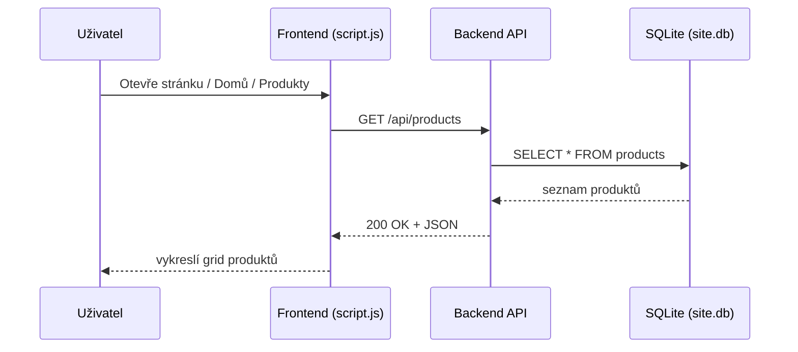
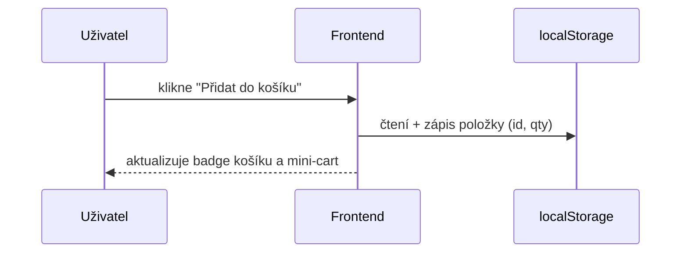
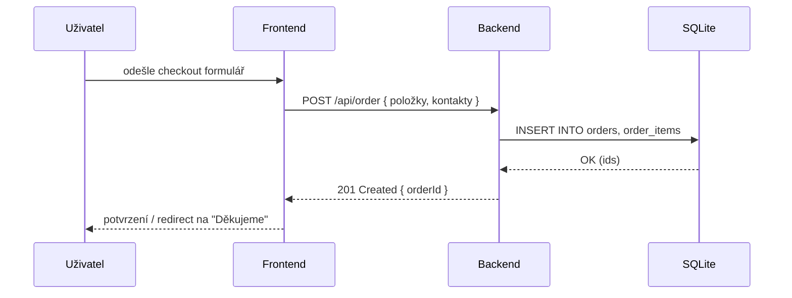
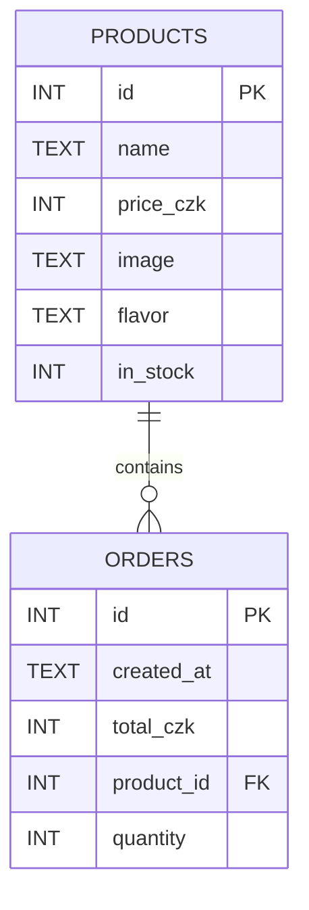
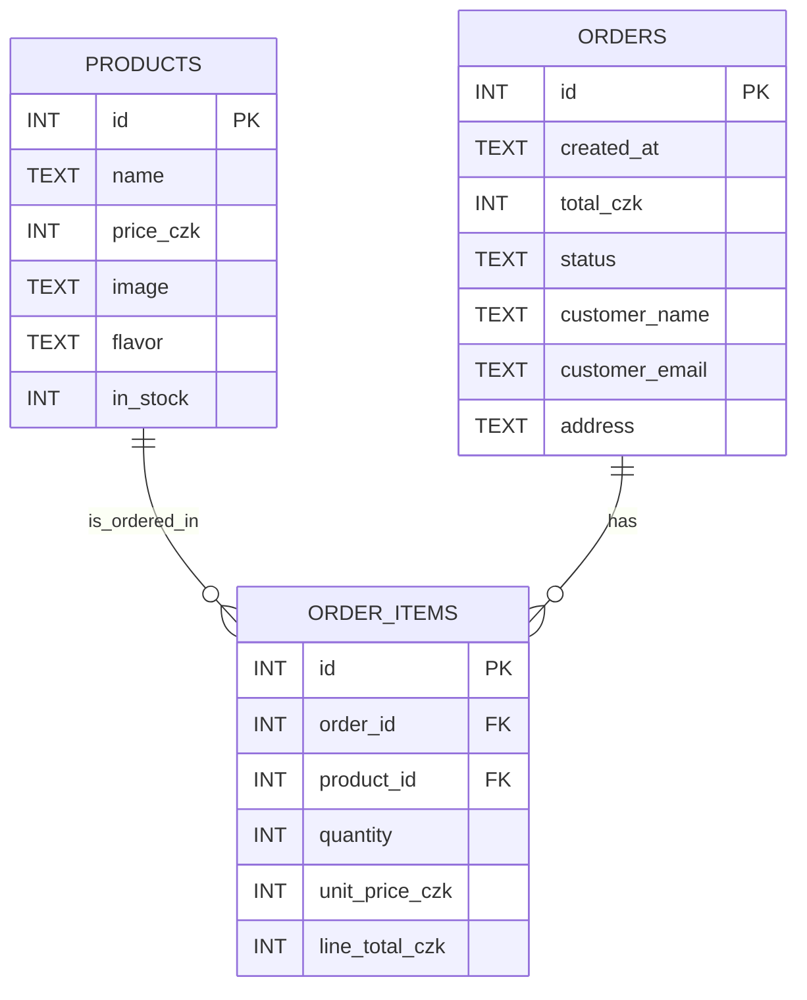

# Architektura projektu, menu, datové toky a ER diagram

Tento dokument shrnuje:
- funkční menu (informační architektura),
- datové toky (co–kde–kam–odkud),
- návrh databáze + ER diagram (aktuální minimum i doporučené rozšíření),
- mapování API endpointů na operace v UI.

---

## Funkční menu (strom)

- Domů (landing + hero, benefity, newsletter)
- Produkty
  - Detail produktu (z karty nebo z výpisu)
- Košík
  - Checkout (odeslání objednávky)
- O nás

Pozn.: Newsletter je komponenta v rámci Domů (ne samostatná stránka).

---

## Datové toky (vysoká úroveň)

```mermaid
graph LR
  U[Uživatel] --> FE[Frontend (HTML/CSS/JS – script.js)]
  FE -->|GET /api/products| API[Backend (Node/Express nebo Flask)]
  API -->|SQL| DB[(SQLite: site.db)]

  FE -->|localStorage| LS[(localStorage: cart)]
  FE -->|POST /api/order| API
  API --> DB
```

- Načtení produktů: FE volá API → API čte z DB.
- Košík: 2 módy
  - lokální (current fallback): FE ukládá košík do `localStorage`,
  - serverový (doporučeno): FE volá API (session/user id), API ukládá do DB.
- Objednávka: FE → API (POST) → DB (vytvoření objednávky, položek objednávky).

---

## Sekvence hlavních use‑cases

### 1) Načtení produktů


### 2) Přidání do košíku (lokální varianta)


### 3) Objednávka (server)


---

## ER diagram – aktuální minimum vs. doporučení

### A) Minimální schéma (odpovídá jednoduchému POST /api/order s jedním produktem)



Pozn.: Tento model vyhoví, pokud jedna objednávka obsahuje vždy 1 produkt. V kódu se volá `POST /api/order` s `product_id` a `quantity`.

### B) Doporučené normalizované schéma (více položek v objednávce)



Volitelná rozšíření:
- USERS (registrace/přihlášení) – vazba USERS ||--o{ ORDERS (uživatel vytváří více objednávek),
- NEWSLETTER_SUBSCRIPTIONS (email, created_at) – nezávislé na objednávkách.

---

## Návrh tabulek (SQL nástin)

Minimální varianta (single‑item objednávka):
```sql
CREATE TABLE IF NOT EXISTS products (
  id INTEGER PRIMARY KEY,
  name TEXT NOT NULL,
  price_czk INTEGER NOT NULL,
  image TEXT,
  flavor TEXT,
  in_stock INTEGER DEFAULT 1
);

CREATE TABLE IF NOT EXISTS orders (
  id INTEGER PRIMARY KEY,
  created_at TEXT DEFAULT (datetime('now')),
  total_czk INTEGER NOT NULL,
  product_id INTEGER NOT NULL,
  quantity INTEGER NOT NULL,
  FOREIGN KEY (product_id) REFERENCES products(id)
);
```

Doporučené normalizované jádro:
```sql
CREATE TABLE IF NOT EXISTS orders (
  id INTEGER PRIMARY KEY,
  created_at TEXT DEFAULT (datetime('now')),
  total_czk INTEGER NOT NULL,
  status TEXT DEFAULT 'new',
  customer_name TEXT,
  customer_email TEXT,
  address TEXT
);

CREATE TABLE IF NOT EXISTS order_items (
  id INTEGER PRIMARY KEY,
  order_id INTEGER NOT NULL,
  product_id INTEGER NOT NULL,
  quantity INTEGER NOT NULL,
  unit_price_czk INTEGER NOT NULL,
  line_total_czk INTEGER NOT NULL,
  FOREIGN KEY (order_id) REFERENCES orders(id),
  FOREIGN KEY (product_id) REFERENCES products(id)
);
```

---

## Mapování API ↔ UI

- GET `/api/products` → výpis produktů (Domů/Produkty)
- GET `/product/:id` (nebo `/api/products/:id`) → detail produktu
- POST `/api/order` → vytvoření objednávky
  - minimální varianta těla: `{ product_id, quantity }`
  - rozšířená varianta: `{ items: [{product_id, quantity}], customer: {...} }`

Pozn.: V `script.js` jsou použité adresy jako `http://localhost:5000/api/products` a `http://127.0.0.1:5000/product/:id`. Doporučení: sjednotit na prefix `/api` a jednu základní URL (např. proměnná prostředí).

---

## Rozložení projektu (stručně)

```
DRIVE_SERVER/
├─ index.html (Domů + komponenty)
├─ Products/, Product-detail/, Cart/, AboutUs/ (podstránky)
├─ script.js (navigace, košík, fetch, render)
├─ style.css (globální styly)
├─ server.js (pokud běží Node backend; alternativně externí API na :5000)
├─ src/db.js, src/seed.js (utility pro DB)
└─ site.db (SQLite, lokální)
```

---

## Export diagramů
V GitHubu si lze Mermaid vykreslit přímo v Markdownu. Pro export do PNG/SVG lze použít VS Code rozšíření „Markdown Preview Mermaid Support“, případně online Mermaid editor.


